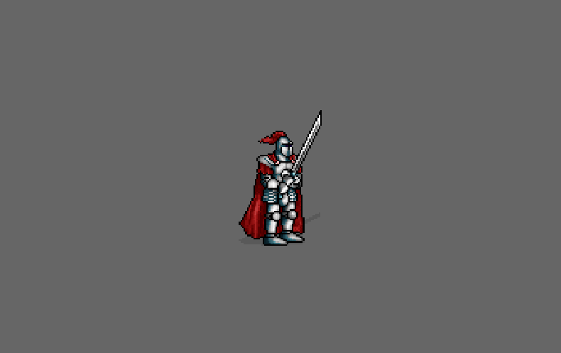

# Aseprite plugin for Bevy

[![latest]][crates.io] [![doc]][docs.rs]

[latest]: https://img.shields.io/crates/v/bevy_mod_aseprite.svg
[crates.io]: https://crates.io/crates/bevy_mod_aseprite
[doc]: https://docs.rs/bevy_mod_aseprite/badge.svg
[docs.rs]: https://docs.rs/bevy_mod_aseprite

A plugin for using [Aseprite][] animations in [Bevy][].

The [`Aseprite`][aseprite-compo] component **requires** Bevy's [`Sprite`][sprite-compo] and
contains two fields:
 * asset: [`Handle<AsepriteAsset>`][aseprite-asset]
 * anim: [`AsepriteAnimation`][aseprite-anim].

[bevy]: https://bevyengine.org/
[aseprite]: https://www.aseprite.org/
[sprite-compo]: https://docs.rs/bevy/latest/bevy/sprite/struct.Sprite.html
[aseprite-compo]: https://docs.rs/bevy_mod_aseprite/latest/bevy_mod_aseprite/struct.Aseprite.html
[aseprite-asset]: https://docs.rs/bevy_mod_aseprite/latest/bevy_mod_aseprite/struct.AsepriteAsset.html
[aseprite-anim]: https://docs.rs/bevy_mod_aseprite/latest/bevy_mod_aseprite/struct.AsepriteAnimation.html

## Example

<p align="center">
    
</p>

See [examples/aseprite.rs][example-aseprite] for a complete example, you can run it with:

```ignore
cargo run --example aseprite
```

[example-aseprite]: https://github.com/lerouxrgd/bevy_mod_aseprite/blob/master/examples/aseprite.rs

## Usage

Basic usage is as follows:

```rust,ignore
fn load_assets(asset_server: Res<AssetServer>, mut ase_handles: ResMut<AsepriteHandles>) {
    let player = asset_server.load("player.ase");
    ase_handles.push(player);
}

fn setup(
    mut commands: Commands,
    ase_handles: Res<AsepriteHandles>,
    ase_assets: Res<Assets<AsepriteAsset>>,
) {
    let ase_handle = &ase_handles[0];
    let ase_asset = ase_assets.get(ase_handle).unwrap();
    let anim = AsepriteAnimation::new(ase_asset.info(), "idle");
    commands.spawn((
        Player,
        Sprite {
            image: ase_asset.texture().clone(),
            texture_atlas: Some(TextureAtlas {
                index: anim.current_frame(),
                layout: ase_asset.layout().clone(),
            }),
            ..default()
        },
        Aseprite {
            anim,
            asset: ase_handle.clone(),
        },
    ));
}

#[derive(Resource, Deref, DerefMut, Default)]
struct AsepriteHandles(Vec<Handle<AsepriteAsset>>);
```

The [`AsepriteAnimation`][aseprite-anim] struct also exposes methods to get information
such as the current animation frame (within a tag or not), its duration, and the number
of remaining frames. This can be useful to transition states at the end of an animation:

```rust,ignore
fn transition_player(
    time: Res<Time>,
    player_q: Query<(&PlayerState, &Aseprite), With<Player>>,
    aseprites: Res<Assets<AsepriteAsset>>,
    mut ev_player_changed: MessageWriter<PlayerChanged>,
) -> Result {
    let (&player_state, ase) = player_q.single()?;
    let ase_asset = aseprites.get(&ase.asset).unwrap();
    // Change the player state to idle at the end of the attack animation
    if let PlayerState::Attack = player_state {
        let remaining_frames = ase.anim.remaining_tag_frames(ase_asset.info()).unwrap();
        let frame_finished = ase.anim.frame_finished(time.delta());
        if remaining_frames == 0 && frame_finished {
            ev_player_changed.send(PlayerState::Stand.into());
        }
    }
    Ok(())
}
```

## Bevy Compatibility

| **bevy** | **bevy_mod_aseprite** |
|----------|-----------------------|
| 0.17     | 0.11                  |
| 0.16     | 0.10                  |
| 0.15     | 0.9                   |
| 0.14     | 0.8                   |
| 0.13     | 0.7                   |
| 0.12     | 0.6                   |
| 0.11     | 0.5                   |
| 0.10     | 0.4                   |
| 0.9      | 0.2, 0.3              |
| 0.8      | 0.1                   |

## History

This crate started as a fork of [mdenchev/bevy_aseprite][].

[mdenchev/bevy_aseprite]: https://github.com/mdenchev/bevy_aseprite
